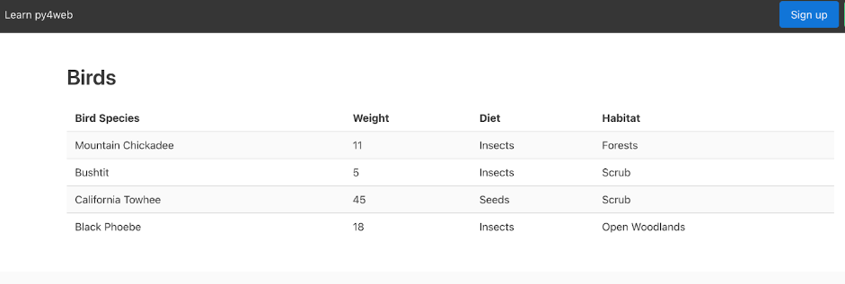

# Homework 2: Generate a Table from json

Copy assignment2/apps/birds from this repo into your personal repo.

Your goal is to modify two files, controllers.py and index.html, so that the content of the file data/table.json is displayed as a table at the URL /birds/index ; the table should look like this:

## Important

The content of the json file should be read inside the action that generates the page so that, if the content changes, visitors of the page always see the most recent data.

It is especially important that you do not hard-code the file name in the application; otherwise if the name of the application changes (which can happen because of grading or in deployment) the file cannot be found.  You can obtain the name of the json file in the application code via:

    from .settings import APP_FOLDER
    filename = os.path.join(APP_FOLDER, "data", "table.json")
